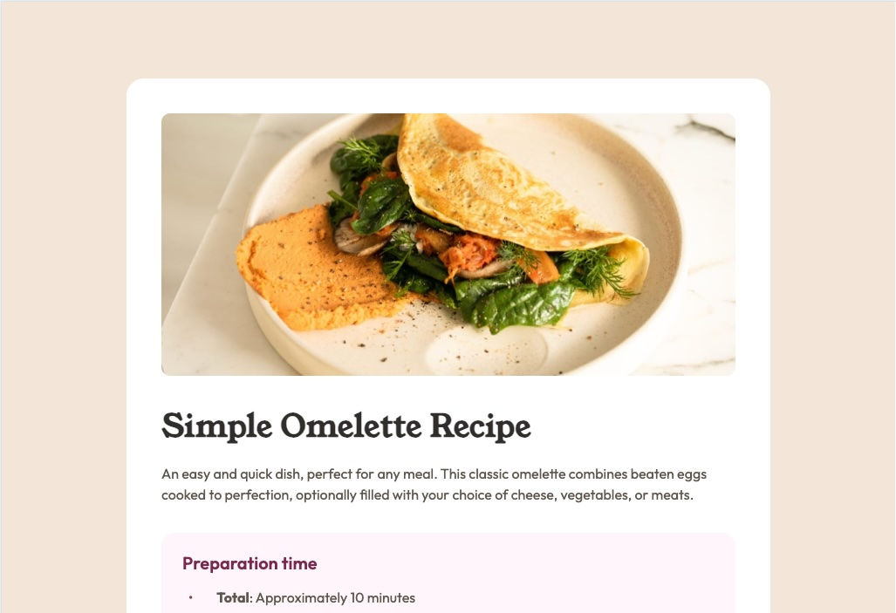

# Frontend Mentor - Recipe page solution

This is a solution to the [Recipe page challenge on Frontend Mentor](https://www.frontendmentor.io/challenges/recipe-page-KiTsR8QQKm). Frontend Mentor challenges help you improve your coding skills by building realistic projects. 

## Table of contents

- [Overview](#overview)
  - [Screenshot](#screenshot)
  - [Links](#links)
- [My process](#my-process)
  - [Built with](#built-with)
- [Author](#author)

## Overview

This challenge is completed with HTML and CSS.

### Screenshot

### Links

- Solution URL: [solution URL](https://github.com/kaaato/recipe-page)
- Live Site URL: [live site URL](https://kaaato.github.io/recipe-page/)

## My process

1. Do research about things that I didn't know from reading through the guideline.
2. Start HTML with semantic elements and try to make a layout that is easier to style with css later.
3. Start CSS after completing the first draft of HTML. 
4. Go back and forth to modify/update both files whenever necessary.

### Built with

- Semantic HTML5 markup
- CSS custom properties
- Flexbox
- CSS Grid
- Mobile-first workflow
- Things I learnt from previous challenges
- [CSS reset](https://piccalil.li/blog/a-more-modern-css-reset/) - Andy Bell

## Author

- Frontend Mentor - [@kaaato](https://www.frontendmentor.io/profile/kaaato)

